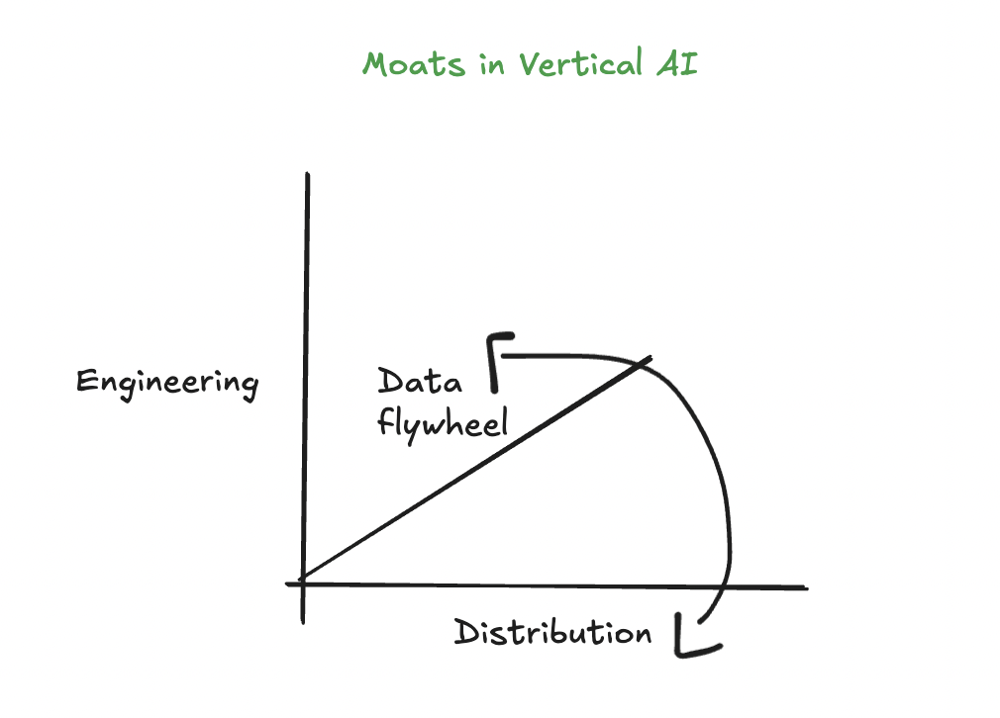

<!-- ## <a href="../index.md" class="home-page-nav-link">🦜 Rohan Sikand</a> -->

&larr; back to <a href="../index.html">home</a>, <a href="../blog.html">blog</a>

## Vertical AI

<!-- November 25, 2024 &nbsp; -->

Visually speaking, here is how I think about vertical AI:

with this being said...
