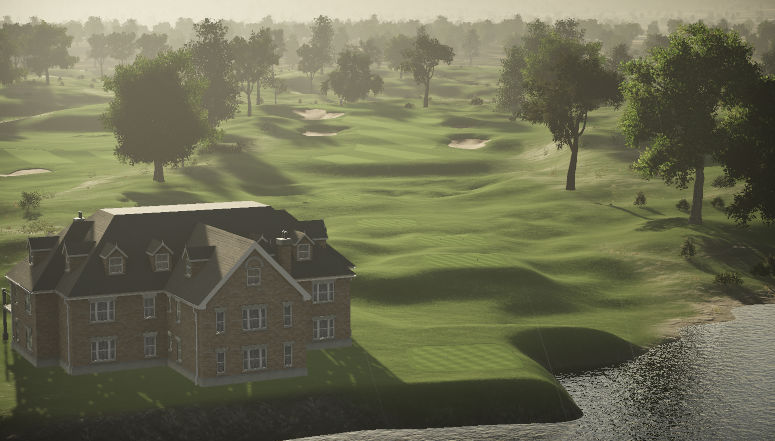
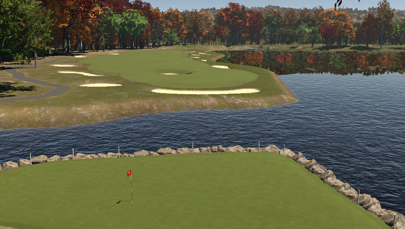

---
format:
  html:
    # mainfont: system-ui
    # minimal: truec
    css: styles/page.css
---

&larr; back to <a href="./index.html">home</a>

## Rohan's Golf Page ⛳️

### Stats

- Current handicap index: *3.4*
- Best [round](https://legacy.ajga.org/microsite/index.asp?tn=2018058#R2Results): *69* (-1; Mill Creek Golf Course - South Course; Boardman, OH; June 21, 2018)

### Courses I've Played

- Pinehurst #2
- Baltusrol (lower)
- St. Andrews

### Course Designs

Laredo Farms GC:

Maple Valley GC:

